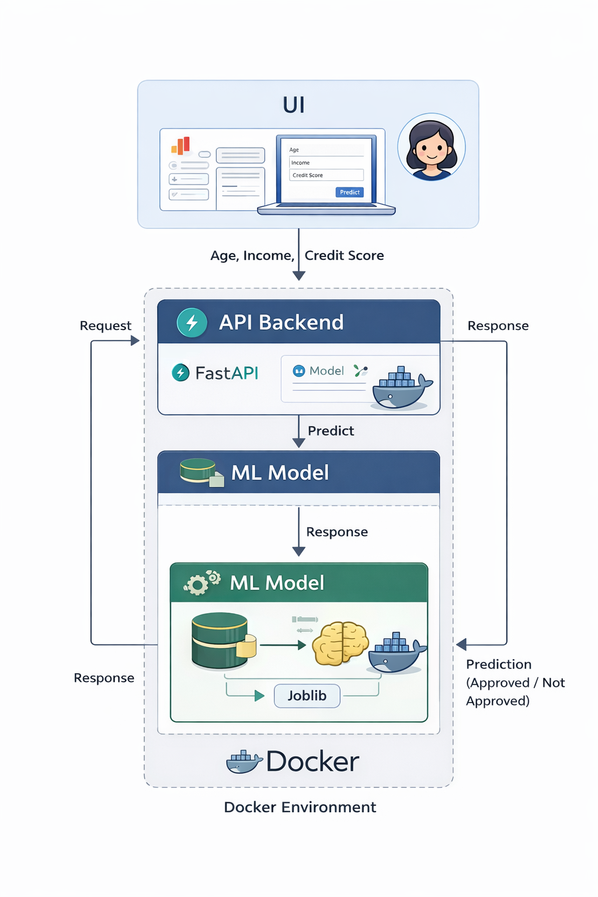

# 🏦 Loan Eligibility & Credit Scoring ML Platform

An end-to-end Machine Learning system that predicts loan eligibility and credit risk using a FastAPI backend, Streamlit frontend, and Dockerized deployment.

This project demonstrates how ML models are taken from training to real-time production inference with proper engineering practices.

---

## 🚀 Features

- ML model training using Scikit-learn
- REST API for real-time predictions using FastAPI
- Interactive UI using Streamlit
- Dockerized setup for easy deployment
- Clean project structure used in production ML systems

---

## 🧠 Problem Statement

Manual loan approval and credit risk assessment is time-consuming and inconsistent.  
This system automates the process using ML to assist in faster and more reliable decisions.

---

## 🏗️ System Architecture

---

## 🛠️ Tech Stack

- Python
- Scikit-learn
- FastAPI
- Streamlit
- Docker
- Joblib

---

## 📁 Project Structure

